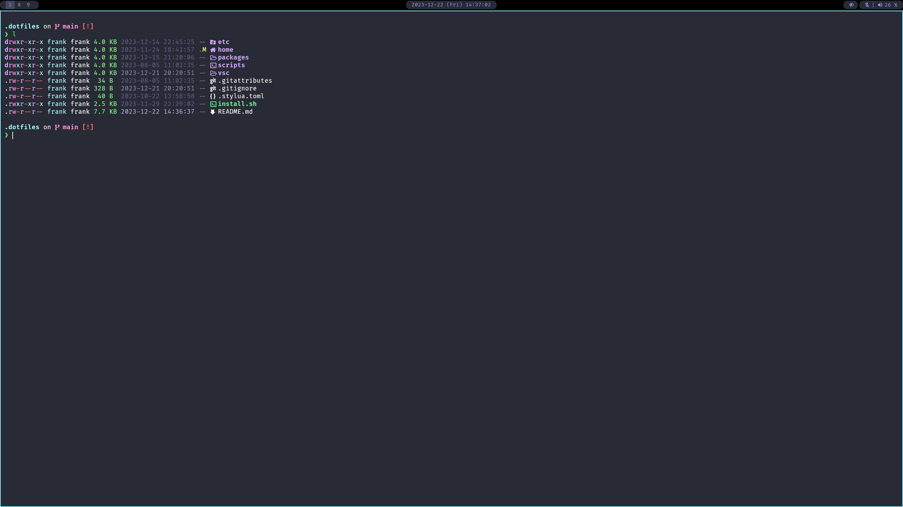
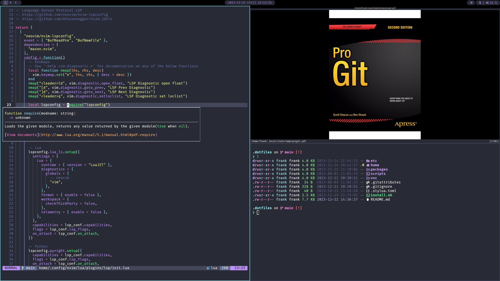
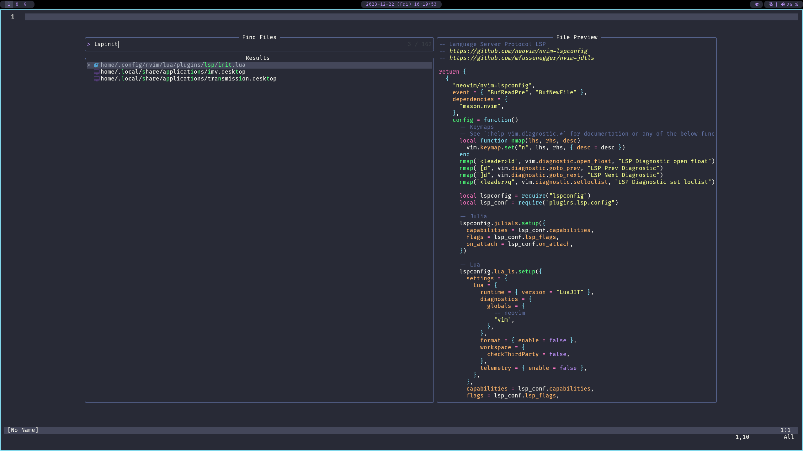

# Dotfiles

## About

This repository contains my personal configuration files (dotfiles) which I
mainly manage with [GNU Stow](https://www.gnu.org/software/stow/). Feel free to
be inspired by them and use parts of it. The color scheme I use is
[dracula](https://draculatheme.com).

Links to my files within this repository are written like [`this`](), while
external links are written like [this]().

- [`etc`](./etc/) contains dotfiles for my `/etc` directory.
- [`home`](./home/) contains dotfiles for my `$HOME` directory.
- [`packages`](./packages/) contains a list of my installed packages.
- [`scripts`](./scripts/) contains scripts for this repository.
- [`vsc`](./vsc/) contains dotfiles for the
  [Vienna Scientific Cluster](https://www.vsc.ac.at) (server)







## Installation and Setup

```sh
git clone https://github.com/frankebel/dotfiles.git ~/.dotfiles
cd ~/.dotfiles
./install.sh
```

Suggestions when asked for packages:

- jack: `pipewire-jack`
- pipewire-session-manager: `wireplumber`
- vulkan-driver: on AMD use `vulkan-radeon`

### Only update home dotfiles

```sh
cd ~/.dotfiles
stow home
```

## Software I use

| Type                    | Name                                                  | Repository                                           | Config                              |
| :---------------------- | :---------------------------------------------------- | :--------------------------------------------------- | :---------------------------------- |
| Operating System        | [Arch Linux](https://archlinux.org/)                  | [GitLab](https://gitlab.archlinux.org/archlinux)     |                                     |
| Compositor              | [Hyprland](https://hyprland.org)                      | [GitHub](https://github.com/hyprwm/Hyprland)         | [`hypr`](home/.config/hypr)         |
| Shell                   | [Zsh](https://www.zsh.org/)                           | [GitHub](https://github.com/zsh-users/zsh)           | [`zsh`](home/.config/zsh)           |
| Shell Prompt            | [Starship](https://starship.rs/)                      | [GitHub](https://github.com/starship/starship)       | [`starship`](home/.config/starship) |
| Terminal Emulator       | [WezTerm](https://wezfurlong.org/wezterm/index.html)  | [GitHub](https://github.com/wez/wezterm)             | [`wezterm`](home/.config/wezterm)   |
| Application Launcher    | Wofi                                                  | [sourcehut](https://hg.sr.ht/~scoopta/wofi)          | [`wofi`](home/.config/wofi)         |
| Color Scheme            | [dracula](https://draculatheme.com/)                  | [GitHub](https://github.com/dracula/dracula-theme)   |                                     |
| Browser                 | [Firefox](https://www.mozilla.org/en-US/firefox/new/) |                                                      |                                     |
| Editor                  | [Neovim](https://neovim.io/)                          | [GitHub](https://github.com/neovim/neovim)           | [`nvim`](home/.config/nvim)         |
| Font                    | [JetBrains Mono](https://www.jetbrains.com/lp/mono/)  | [GitHub](https://github.com/JetBrains/JetBrainsMono) |                                     |
| Image Viewer            | imv                                                   | [sourcehut](https://sr.ht/~exec64/imv/)              | [`imv`](home/.config/imv)           |
| Mail                    | [Neomutt](https://neomutt.org/)                       | [GitHub](https://github.com/neomutt/neomutt)         | [`neomutt`](home/.config/neomutt)   |
| Mailbox Synchronization | [isync](https://isync.sourceforge.io/)                |                                                      | [`isync`](home/.config/isync)       |
| Media Player            | [mpv](https://mpv.io/)                                | [GitHub](https://github.com/mpv-player/mpv)          | [`mpv`](home/.config/mpv)           |
| Notifications           | [dunst](https://dunst-project.org/)                   | [GitHub](https://github.com/dunst-project/dunst)     | [`dunst`](home/.config/dunst)       |
| PDF Viewer              | [zathura](https://pwmt.org/projects/zathura/)         | [GitLab](https://git.pwmt.org/pwmt/zathura)          | [`zathura`](home/.config/zathura)   |
| Encryption              | [GnuPG](https://gnupg.org/)                           |                                                      | [`gnupg`](home/.local/share/gnupg)  |
| Password Manager        | [pass](https://www.passwordstore.org/)                | [Repo](https://git.zx2c4.com/password-store/)        |                                     |
| RSS Reader              | [Newsboat](https://newsboat.org/)                     |                                                      | [`newsboat`](home/.config/newsboat) |
| Screenshots             | grim                                                  | [sourcehut](https://git.sr.ht/~emersion/grim)        |                                     |

## Dependencies

The following programs are necessary to use my dotfiles fully:

### Neovim

- [fd](https://github.com/sharkdp/fd)
- [ripgrep](https://github.com/BurntSushi/ripgrep)

```sh
sudo pacman -S fd ripgrep
```

## Explanation about software

If possible I try to follow the
[XDG Base Directory Specification](https://specifications.freedesktop.org/basedir-spec/basedir-spec-latest.html).
For software which does not follow it, I try to export the environment variables
in [`environment`](./home/.config/shell/environment).

### Compositor

Since I like the tiling workflow and want to use
[Wayland](https://wayland.freedesktop.org/), [Hyprland](https://hyprland.org) is
my wayland compositor of choice. For the statusbar I run
[Waybar](https://github.com/Alexays/Waybar).

### Mail

I use [isync](https://isync.sourceforge.io/) to synchronize my local mailbox.
[Go IMAP notify](https://gitlab.com/shackra/goimapnotify) is running in the
background using IMAP IDLE. To read mails in the command line
[neomutt](https://neomutt.org/) is used.

### RSS

[Newsboat](https://newsboat.org/) is my terminal RSS Reader of choice. Videos
can be directly viewed with [mpv](https://mpv.io).

### Editor

I use [Neovim](https://neovim.io/) as my text editor. As I use
[lazy.nvim](https://github.com/folke/lazy.nvim) as my package manager, the list
of installed plugins can be viewed in
[`lazy-lock.json`](home/.config/nvim/lazy-lock.json). Further information can be
read [`here`](./home/.config/nvim/README.md).

### Operating System

I use [Arch Linux](https://archlinux.org/) for my operating system as I like
their simple and pragmatic approach. I created an install script
[archinstall](https://github.com/frankebel/archinstall) for faster setup.

### Password Management

I use [pass](https://www.passwordstore.org/) and
[pass-otp](https://github.com/tadfisher/pass-otp) to store and manage my
passwords. It is set up as a git repository containing `*.gpg` files which makes
version control very easy. To quickly retrieve and enter my credentials, I use
[tessen](https://github.com/ayushnix/tessen).

### Scripts

Scripts I wrote are in [`home/.local/bin`](home/.local/bin).
